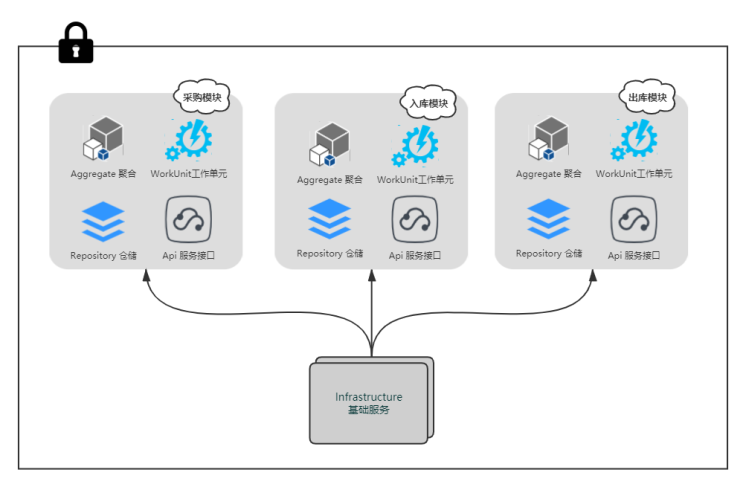

> 一个[Biscuits](https://github.com/leyan95/biscuits)的小Demonstrate。

**文档 [Link](https://www.yuque.com/shusheng/suibqb/rxi3sd)** 未及时更新，可以参考本案例。

---

## 案例说明
### 初始化数据库
- 新建数据库 `biscuits_demo`
- 使用 `src` 目录下的 `biscuits-demo.sql` 文件对 `biscuits_demo` 数据库进行初始化。
### 配置
- 修改 `src/main/resources/application.yml` 文件中的数据库用户名、密码
### 启动
- 执行 `src/main/java/org/hv/Application.java`
### 目录结构
```
├── demo/bundles                        //功能点目录
│   ├── authority                       //用户认证功能点目录（包含：注册、登录）
│   └── bundle_order                    //订单功能点目录
│       ├── aggregate                   //聚合
│       ├── controller                  //应用层服务
│       ├── repository                  //仓储
│       └── service                     //工作单元
│   ├── bundle_relevant                 //关联单据功能点目录
│   ├── DemoBundleRegister.java         //功能点注册中心
│   └── DemoPermission.java             //权限注册中心
├── infrastructure                      //基础服务目录，用作功能点之间的数据交互做到最大程度地解耦
│   ├── constant                        //基础服务常量放置目录
│   ├── mediator                        //中介服务目录
│   ├── monitor                         //观察者服务目录
│   └── processnode                     //状态流转服务目录
└── Application.java                    //启动程序
```

## 功能点设计思路
### 分层结构


#### 展现层
负责向用户展现信息以及解释用户命令。更细的方面来讲就是：

- 请求应用层以获取用户所需要展现的数据；
- 发送命令给应用层要求其执行某个用户命令；
    
#### 应用层
很薄的一层，定义软件要完成的所有任务。对外为展现层提供各种应用功能（包括查询或命令），对内调用领域层（领域对象或领域服务）完成各种业务逻辑，应用层不包含业务逻辑。

#### 领域层
负责表达业务概念，业务状态信息以及业务规则，领域模型处于这一层，是业务软件的**核心**。

#### 基础设施层
本层为其他层提供通用的技术能力；提供了层间的通信；为领域层实现持久化机制；总之，基础设施层可以通过架构和框架来支持其他层的技术需求；

### 功能点分块结构

